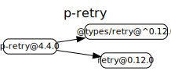

# 源码分析

## 文件结构

``` bash
/Users/liufang/openSource/FunnyLiu/p-retry
├── index.d.ts
├── index.js
├── index.test-d.ts
├── license
├── package.json
├── readme.md
└── test.js

file: 7

ignored

```

## 外部模块依赖



## 内部模块依赖


  


# p-retry

> Retry a promise-returning or async function

It does exponential backoff and supports custom retry strategies for failed operations.

## Install

```
$ npm install p-retry
```

## Usage

```js
const pRetry = require('p-retry');
const fetch = require('node-fetch');

const run = async () => {
	const response = await fetch('https://sindresorhus.com/unicorn');

	// Abort retrying if the resource doesn't exist
	if (response.status === 404) {
		throw new pRetry.AbortError(response.statusText);
	}

	return response.blob();
};

(async () => {
	console.log(await pRetry(run, {retries: 5}));
})();
```

## API

### pRetry(input, options?)

Returns a `Promise` that is fulfilled when calling `input` returns a fulfilled promise. If calling `input` returns a rejected promise, `input` is called again until the maximum number of retries is reached. It then rejects with the last rejection reason.


Does not retry on most `TypeErrors`, with the exception of network errors. This is done on a best case basis as different browsers have different [messages](https://developer.mozilla.org/en-US/docs/Web/API/Fetch_API/Using_Fetch#Checking_that_the_fetch_was_successful) to indicate this. See [whatwg/fetch#526 (comment)](https://github.com/whatwg/fetch/issues/526#issuecomment-554604080)


#### input

Type: `Function`

Receives the current attempt number as the first argument and is expected to return a `Promise` or any value.

#### options

Type: `object`

Options are passed to the [`retry`](https://github.com/tim-kos/node-retry#retryoperationoptions) module.

##### onFailedAttempt(error)

Type: `Function`

Callback invoked on each retry. Receives the error thrown by `input` as the first argument with properties `attemptNumber` and `retriesLeft` which indicate the current attempt number and the number of attempts left, respectively.

```js
const run = async () => {
	const response = await fetch('https://sindresorhus.com/unicorn');

	if (!response.ok) {
		throw new Error(response.statusText);
	}

	return response.json();
};

(async () => {
	const result = await pRetry(run, {
		onFailedAttempt: error => {
			console.log(`Attempt ${error.attemptNumber} failed. There are ${error.retriesLeft} retries left.`);
			// 1st request => Attempt 1 failed. There are 4 retries left.
			// 2nd request => Attempt 2 failed. There are 3 retries left.
			// …
		},
		retries: 5
	});

	console.log(result);
})();
```

The `onFailedAttempt` function can return a promise. For example, you can do some async logging:

```js
const pRetry = require('p-retry');
const logger = require('./some-logger);

const run = async () => { … };

(async () => {
	const result = await pRetry(run, {
		onFailedAttempt: async error => {
			await logger.log(error);
		}
	});
})();
```

If the `onFailedAttempt` function throws, all retries will be aborted and the original promise will reject with the thrown error.

### pRetry.AbortError(message)
### pRetry.AbortError(error)

Abort retrying and reject the promise.

### message

Type: `string`

Error message.

### error

Type: `Error`

Custom error.

## Tip

You can pass arguments to the function being retried by wrapping it in an inline arrow function:

```js
const pRetry = require('p-retry');

const run = async emoji => {
	// …
};

(async () => {
	// Without arguments
	await pRetry(run, {retries: 5});

	// With arguments
	await pRetry(() => run('🦄'), {retries: 5});
})();
```

## Related

- [p-timeout](https://github.com/sindresorhus/p-timeout) - Timeout a promise after a specified amount of time
- [More…](https://github.com/sindresorhus/promise-fun)
